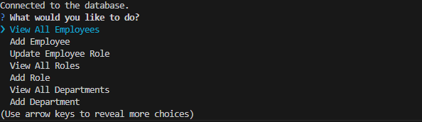
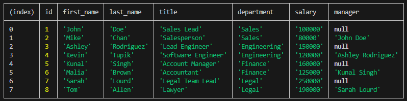

# Employee_Manager_CMS

## Description

This project is a simple content management system or CMS for a database of employee's. The program just runs in a terminal but provides the user's the ability to create departments, job roles, and employee's that full under the other two. The terminal has no delete functions but it does give you the power to create new roles, departments, and employees. The program also lets you the ability to update current employee's info as well. Finally the cms lets you view tables of info about employee's, roles, and departments. This is a simple terminal for interfacing with a postgreSQL data base however I made it as good example project showing how such a interface could be made by anyone using node js and packages pg, and inquirer.

## Table of Contents

- [Installation](#installation)
- [Usage](#usage)
- [Credits](#credits)
- [License](#license)

## Installation

- copy either all the files from the repository to your computer or use your git bash terminal to clone the repository down to your own machine. 
- make sure you have [node js](https://nodejs.org/en) and the package manager that comes with it.
- make sure you alse have a postgreSQL server on the same machine as well that is configured to listen on port 5432.
- change the .env.example file to .env file and fill out the DB_NAME, DB_USER, DB_PASSWORD with your database name, user name, and password.
- In the assets/db folder you can find sql files for the schema to set up the database with the structure required for this application.
- There is also a seeds file to put some starter data into your database after you set up the schema for the database as well.
- run the following command in the project folder terminal: "npm i" (don't include the quotation marks). This will download all the needed dependencies for the project.

## Usage

- After installing the project run in the project terminal: "node index.js" (don't include the quotation marks).
- The program should open up a terminal with list of options. Scroll through the menu and hit enter when get to the chosen command you want to run. Example Below:

- An additional list of questions will pop up in the terminal for the command if it is one of the add or update commands.
- For these type of commands answer the list of questions to finsh using the command. This should then send the proper query to your sql database.
- If for some reason the query fails to work the program will kick you back to main menu and give you an error unless a major error occures in which case the program will crash.
- Commands that start with view will view info from your database based on command you picked. Example of the table that the command View All Employees returns in the terminal:

- After running a command the program will take you back to original list of commands.
- Once your done using the terminal just use the quit option in list of commands to stop the program.
- For a walkthrough of how to use the application [Click Here](https://drive.google.com/file/d/1KU-DyamHtxcfVac5HVI7PrLaOTYQjx7m/view).

## Credits

Project Designer: Kalab Smith
- [K-Lab-Code](https://github.com/K-Lab-Code)
- [kalabsb@me.com](mailto:kalabsb@me.com)

## License

Distributed under the MIT License. See LICENSE.txt for more information.
